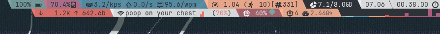

# Wezterm Config

My wezterm configs are a bit of a mess. 

I use wezterm a few different ways. 

- Main Terminal
- Status Bar / Quake Console
- Debug Config for Debug compiled Wezterm

| Preview Main Desktop |
|   :--:   |
|  |
| The status bar at the top and the main terminal are both wezterm |
|  |

### Config Entry Points 

| Syntax      | Description |
| ----------- | ----------- |
| Main Terminal      | [wezterm.lua](wezterm.lua) [launchscript](../../.config/bspwm/bin/bspterm)       |
| Status Bar / Quake Console   | [wezterm_bar.lua](wezterm_bar.lua) [launch script](../../.local/bin/wezbar)       |
| Modal/Dialog   | [wezterm_modal.lua](wezterm_modal.lua)  [launch script](../../.local/bin/wezmodal)      |
