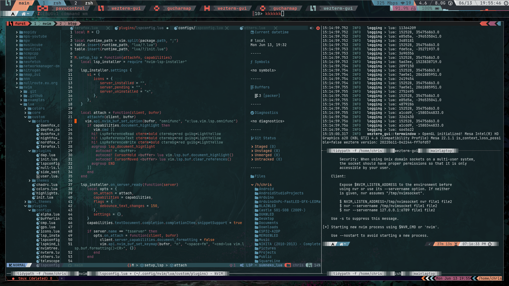
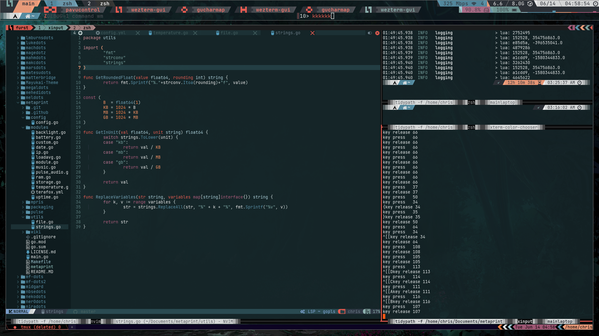

# Wezterm Config

My wezterm configs are a bit of a mess. 

I use wezterm a few different ways. 

- Main Terminal
- Status Bar / Quake Console
- Debug Config for Debug compiled Wezterm

| Preview | Preview |
|   :--:   |   :--:   |
|  |  |
|  :--:  |  :--:  |
| Status at top main taking majority of the screen| stuff j|

### Config Entry Points 

| Syntax      | Description |
| ----------- | ----------- |
| Main Terminal      | wezterm.conf       |
| Status Bar / Quake Console   | wezterm_bar.conf        |
